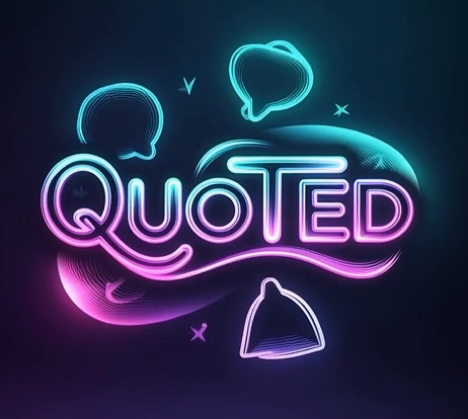

# 📚 Quoted

**Online:** 29 Nov 2025

  

A digital library of wisdom — a curated collection of profound insights and timeless quotes across philosophy, psychology, business, and personal development.

## 🌟 About

Quoted is more than just a quote repository. It's a thoughtfully organized digital library that connects deep wisdom across multiple domains of human knowledge. Each topic page contains carefully selected quotes that build upon each other to form a cohesive understanding of fundamental life principles.

## 🎯 Purpose

In an age of information overload, Quoted serves as a compass for meaningful knowledge. The project aims to:

- **Curate** truly insightful quotes (no clichés or empty platitudes)
- **Connect** wisdom across different domains and disciplines  
- **Provide** a clean, distraction-free reading experience
- **Organize** knowledge in a way that's both accessible and profound

## 🏗️ Structure

The library is organized into thematic pages, each exploring a specific concept in depth:

### Core Categories
- **Philosophy & Mindset** (`absurdism.html`, `existentialism.html`, `stoicism.html`)
- **Psychology & Behavior** (`beliefs.html`, `fear.html`, `cognitive-dissonance.html`)
- **Business & Productivity** (`business.html`, `productivity.html`, `leadership.html`)
- **Personal Development** (`skill-development.html`, `habits.html`, `discipline.html`)
- **Life & Relationships** (`fatherhood.html`, `marriage.html`, `friends.html`)

### Featured Pages
- `beliefs.html` - The architecture of reality and the will to power
- `fear.html` - The shadow that precedes growth  
- `ideas.html` - The currency of consciousness
- `fundamentals.html` - The architecture of mastery
- `consistency.html` - The architecture of compound growth

## 🚀 Features

- **Mobile-first responsive design**
- **Clean, minimalist interface** focused on content
- **Fast loading** with optimized assets
- **Easy navigation** between related topics
- **Highlighted key insights** in each category
- **Growing collection** of curated wisdom

## 🛠️ Technology

- Pure HTML, CSS, and JavaScript
- Responsive grid layout
- Google Fonts (Orbitron, Exo 2, Share Tech Mono)
- Mobile-optimized navigation
- No external dependencies or frameworks

## 📖 How to Use

1. **Browse by topic** - Navigate through the sidebar categories
2. **Read deeply** - Each page contains 15-20 curated quotes on a specific theme
3. **Make connections** - Notice how wisdom from different domains complements each other
4. **Apply insights** - The true value comes from integrating these ideas into daily life

## 🎨 Design Philosophy

The design follows a "digital library" aesthetic with:
- **Readability first** - Clean typography, ample whitespace
- **Consistent visual hierarchy** - Clear distinction between quotes and categories
- **Subtle tech-inspired elements** - Paying homage to the digital nature of the library
- **Focus on content** - No unnecessary decorations or distractions

## 🤝 Contributing

While this is primarily a personal curation project, thoughtful suggestions are welcome. The bar for inclusion is high — quotes must be:
- Truly insightful (not just popular or catchy)
- Actionable or thought-provoking
- Free from clichés and empty platitudes
- Complementary to the existing collection

## 📄 License

This project is open source and available under the [MIT License](LICENSE).

## 🙏 Acknowledgments

Quoted stands on the shoulders of giants — the philosophers, writers, thinkers, and doers whose wisdom forms the content of this library. Special thanks to all the original authors whose insights continue to illuminate the human experience.

---

*"The mind that opens to a new idea never returns to its original size."*
